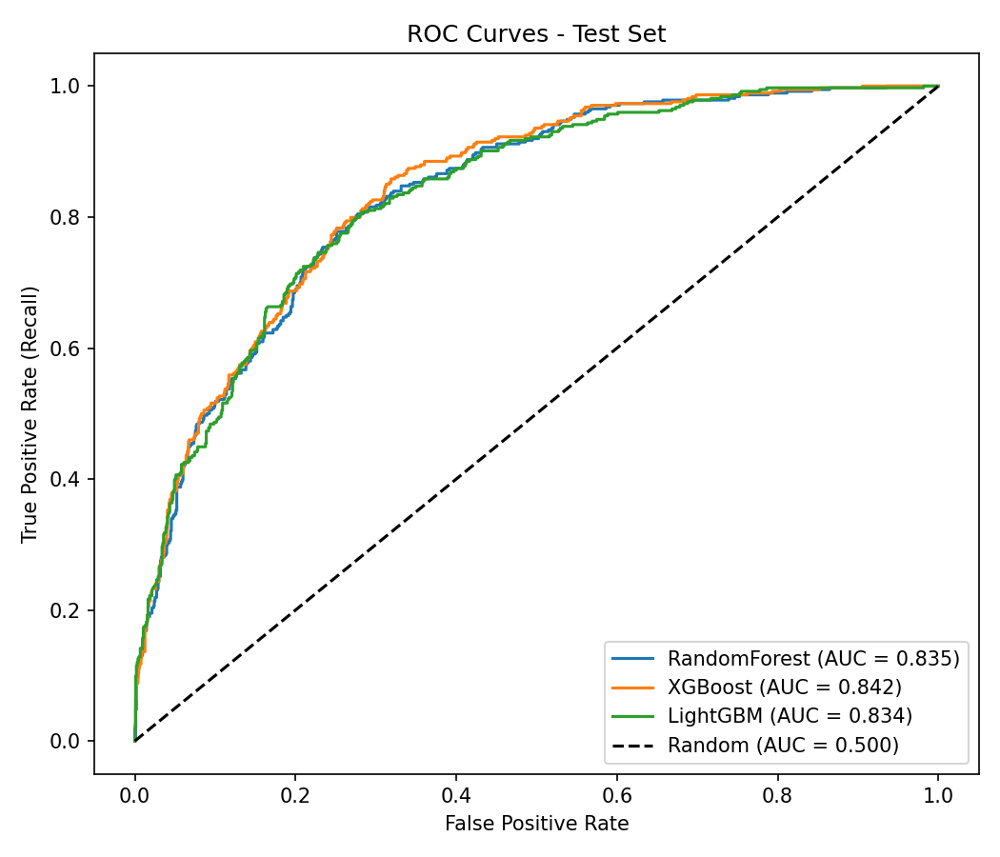
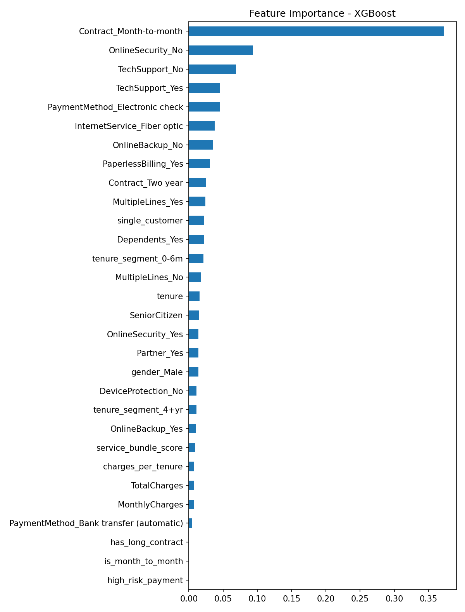

# Customer Churn Prediction

An end-to-end machine learning pipeline that predicts which telecom customers are likely to churn, so retention teams can act before they leave.

**Dataset:** [IBM Telco Customer Churn](https://github.com/IBM/telco-customer-churn-on-icp4d), 7,043 customers, 21 attributes, 26.5% churn rate.

## Results

All models are tuned with RandomizedSearchCV (10 combinations × stratified 5-fold CV). The best model is selected by **CV ROC-AUC**, and the held-out test set (20%, 1,409 customers) is used only once, for final evaluation.

| Model | CV ROC-AUC | Test ROC-AUC | Precision | Recall | F1 | Accuracy | Features kept |
|---|---|---|---|---|---|---|---|
| Random Forest | 0.8416 | 0.8355 | 0.5649 | **0.6283** | **0.5949** | 0.7729 | 25 |
| **XGBoost (best)** | **0.8432** | **0.8421** | **0.6011** | 0.5802 | 0.5905 | **0.7864** | 25 |
| LightGBM | 0.8373 | 0.8344 | 0.5899 | 0.5963 | 0.5931 | 0.7828 | 14 |

Precision, recall and F1 are for the churn class at the default 0.5 threshold.

- **XGBoost** gives the best ranking of customers by churn risk (highest ROC-AUC) and the most precise churn flags.
- **Random Forest** catches the most churners (highest recall), which is useful when missing a churner costs more than an unnecessary retention offer.
- CV and test scores are within 0.01 for every model, which indicates no data leakage and good generalisation.




## Key Business Insights (from EDA)

| Segment | Churn rate |
|---|---|
| Month-to-month contract | 42.7% (vs 2.8% on two-year contracts) |
| Tenure of 0–6 months | 52.9% (vs 9.5% after 4+ years) |
| Electronic check payment | 45.3% (vs 15–19% for other methods) |
| Fiber optic internet | 41.9% (vs 19.0% for DSL) |
| No tech support | 41.6% (vs 15.2% with tech support) |
| Senior citizens | 41.7% (vs 23.6% for non-seniors) |

**Highest-risk profile:** new customers on month-to-month contracts, paying high monthly bills by electronic check, without add-on support services.

**Suggested actions:** incentives to move to one- or two-year contracts, onboarding support in the first 6 months, and promotion of auto-pay methods and bundled support services.

## Pipeline

```
CSV data ──► SQLite (SQLAlchemy) ──► Cleaning ──► Stratified 80/20 split
                                                        │
          ┌─────────────────────────────────────────────┘
          ▼   (imblearn Pipeline, fitted inside every CV fold)
  Feature engineering ─► One-hot encoding ─► SMOTE ─► SelectFromModel (RF) ─► Classifier
                                                                                │
          RandomizedSearchCV · stratified 5-fold · refit on ROC-AUC ◄──────────┘
                                                        │
                                   Best model by CV ROC-AUC ─► Test-set evaluation
```

### Data leakage prevention
- The train/test split happens before any learned transformation.
- Feature engineering, encoding, **SMOTE** and **feature selection** all sit inside one `imblearn` Pipeline, so they are fitted only on the training folds. Synthetic SMOTE samples never reach validation or test data.
- The best model is chosen by cross-validation score, not test score.

### Feature engineering

| Feature | Description |
|---|---|
| `tenure_segment` | Tenure buckets: 0–6m, 6m–1yr, 1–2yr, 2–4yr, 4+yr |
| `is_month_to_month`, `has_long_contract` | Contract type flags |
| `service_bundle_score` | Number of add-on services (security, backup, device protection, tech support) |
| `charges_per_tenure` | Total charges ÷ (tenure + 1), a measure of spending intensity |
| `high_monthly_charges` | Monthly charge above the training-set median |
| `high_risk_payment` | Pays by electronic check |
| `single_customer` | No partner and no dependents |

### Class imbalance
Only 26.5% of customers churn. **SMOTE** oversamples the minority class inside each training fold, so the models learn churn patterns instead of defaulting to "no churn".

### Model-based feature selection
`SelectFromModel` with a Random Forest keeps the features whose importance is above a tuned threshold (mean, median or 0.5 × mean). It reduced the 53 encoded features to 25 for XGBoost and Random Forest, and to 14 for LightGBM.

### Models
- **Random Forest:** bagging ensemble of decision trees
- **XGBoost:** gradient boosting with level-wise tree growth and L2 regularisation
- **LightGBM:** gradient boosting with leaf-wise tree growth and histogram binning

## Project Structure

```
├── ingestion_db.py      # Downloads data, loads CSVs into SQLite via SQLAlchemy
├── features.py          # Cleaning, stratified split, FeatureEngineer transformer, preprocessor
├── train.py             # Full pipeline, hyperparameter tuning, evaluation, reports
├── logging_setup.py     # Logging configuration
├── eda.ipynb            # Exploratory data analysis
├── requirement.txt      # Dependencies
└── reports/
    ├── results.md               # Results table
    ├── roc_curves.png           # ROC curves of all models (test set)
    ├── feature_importance.png   # Feature importance of best model
    ├── training_report.txt      # Best hyperparameters, confusion matrices, classification reports
    └── metadata.json            # Full run metadata
```

## How to Run

### Google Colab (recommended)
```python
!git clone https://github.com/harsh3-web/-Customer-Churn-Prediction.git
%cd ./-Customer-Churn-Prediction
!pip install -q -r requirement.txt
!python ingestion_db.py
!python train.py
```

### Local
```bash
git clone https://github.com/harsh3-web/-Customer-Churn-Prediction.git
cd ./-Customer-Churn-Prediction
pip install -r requirement.txt
python ingestion_db.py
python train.py
```

The dataset downloads automatically on the first run. Training takes about 15–25 minutes on a standard CPU.

## Tech Stack

Python · pandas · NumPy · SQLAlchemy · SQLite · scikit-learn · imbalanced-learn · XGBoost · LightGBM · Matplotlib · Seaborn

## Future Improvements

- **Threshold tuning** using the precision-recall curve, based on the cost of a retention offer vs. the value of a customer
- **SMOTENC** instead of SMOTE, to handle one-hot categorical features without creating fractional values
- **SHAP values** to explain individual customer predictions to the retention team
- **Deployment** as a REST API with periodic retraining and data-drift monitoring
